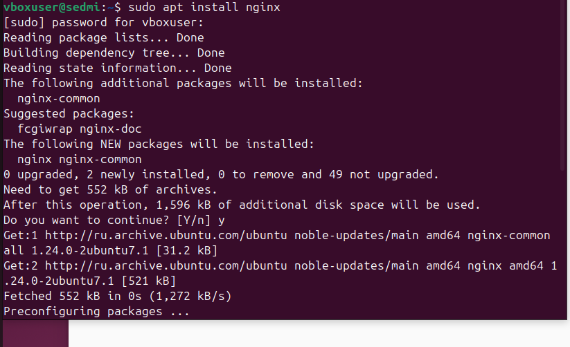
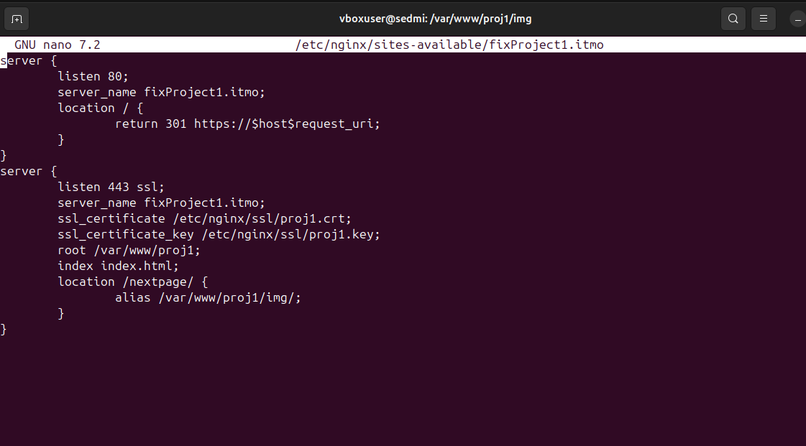
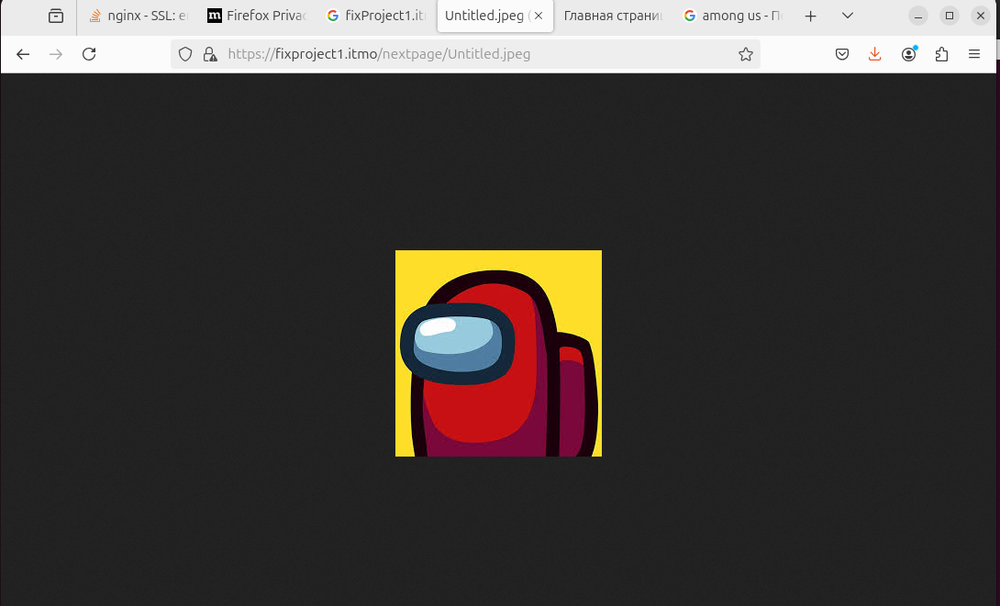

# Первая лаба

## ТЗ

Нужно, чтобы:

* Подключение осуществлялось через протокол https с сертификатом;
* Было настроено принудительное перенаправление HTTP-запросов (порт 80) на HTTPS (порт 443) для обеспечения безопасного соединения;
* Использовался alias для создания псевдонимов путей к файлам или каталогам на сервере;
* Имелись настроенные виртуальные хосты для обслуживания нескольких доменных имен на одном сервере.

## Установим nginx

Делать все будем на виртуалке. В консоли запустим команду установки.



Проверим, что все работает


Эта страница означает, что все отлично и nginx подключен.

## Создание проектов

Создадим два проекта по путям /var/www/proj1 /var/www/proj2

В качестве hmtl файлов я взял файл из моего рабочего проекта без стилей.

Дальше нужно прописать проектам домены, чтобы их можно было запускать.

С помощью команды
```bash
sudo nano /etc/hosts
```
 мы попадаем в файлик, где нужно прописать домены. Пропишем домены fixProject1.itmo и fixProject2.itmo


После того, как ввели домены, просто сохраним файл. Домены мы настроили, но без файлов конфигурации ничего не запустится.

## Настройка файлов конфигурации

Нужно создать самоподписанные сертификаты. Для этого введем команду в консоли для каждого сайта.


После этого настроим файлы конфигурации сайтов. В них пропишем нахождение сертификатов, необходимые нам порты и путь до самих директорий с проектами

 

Активируем их командами

```bash
sudo ln -s /etc/nginx/sites-available/fixProject1.itmo /etc/nginx/sites-enabled/
sudo ln -s /etc/nginx/sites-available/fixProject2.itmo /etc/nginx/sites-enabled/
```
Теперь у нас запускаются наши сайты по доменам. Также происходит перенаправление на https.


## Альясы

Настроим, чтобы от корневого каталога по ссылке открывалась картинка. Исправим файл конфигурации.

В директорию с проектом добавим папку img и положим туда картинку. В альясе запишем, какой путь надо указать, чтобы открыть эту картинку.




Все работает.



## Вывод

Я устал.